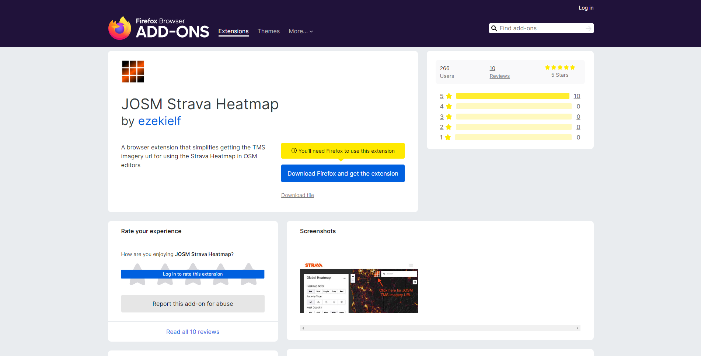
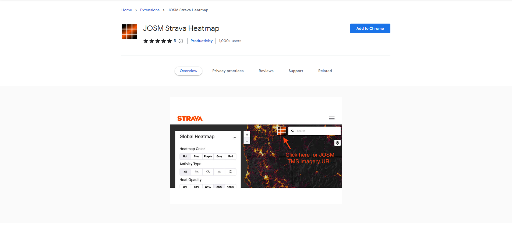
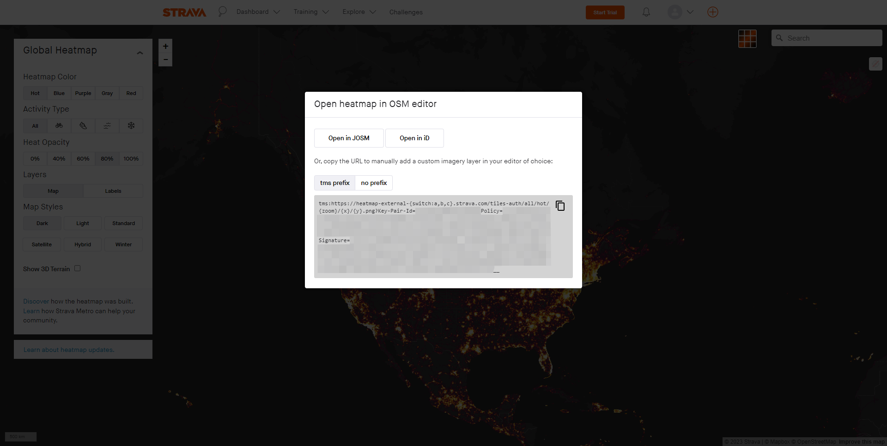
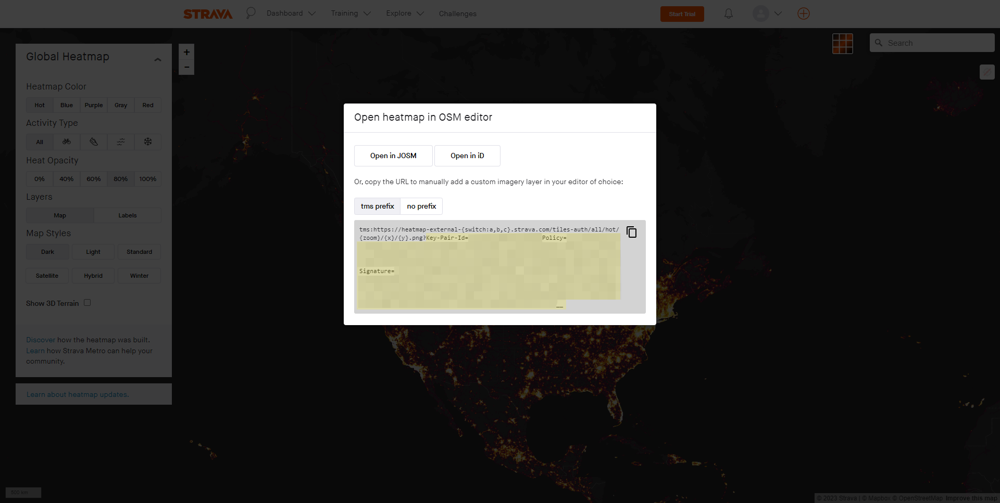
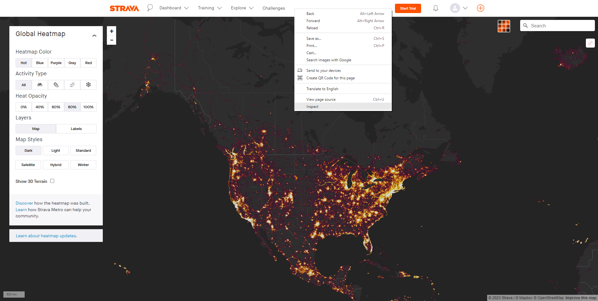
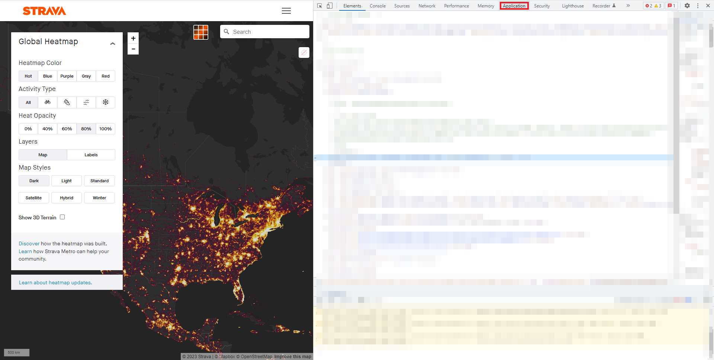
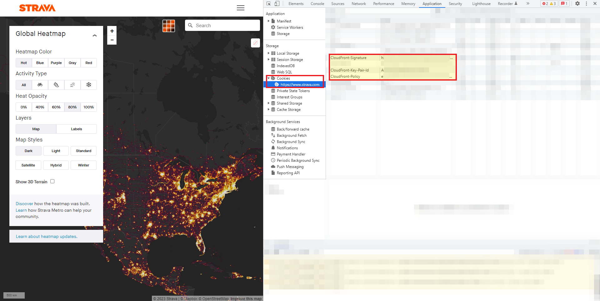

# HI Outdoor Recreation Analysis

MoveApps

Github repository: *https://github.com/MattK-16/hi_outdoor_recreation_analysis/*

## Description
Compute the intensity of human activity associated with each GPS point in a MovingPandas TrajectoryCollection based on the RGBA values and distance of Strava Global Heatmap pixels. 

## Documentation
This app determines the distance that GPS points are from human activity hotspots as indicated by the blue version of the Strava Global Heatmap. RGBA values are extracted from the heatmap at a 100m resolution for the extent of the MovingPandas TrajectoryCollection that is passed to the app. RGBA values are assigned to each point based on an intersection between the points provided and the Strava Global Heatmap. An intensity value closer to 1 indicates a higher relative intensity of use and a value closer to 0 indicates a lower relative intensity of use. This information is added to the MovingPandas TrajectoryCollection that is given at the start of this process.

### Input data
MovingPandas TrajectoryCollection in Movebank format is accepted as input. Additionally, a Cloudfront-Key-Pair-ID, Cloudfront-Policy, and Cloudfront-Signature will be needed from the [Strava Global Heatmap](www.strava.com/heatmap). The information can be acquired in a number of different ways as illustrated in the following sections. It is important to note that a **Strava User Account** is needed for this App to function properly.  

#### Obtain Cookie Values Using Browser Extension
The pertinent Strava information can be obtained using already designed tools that extract this information. It is available as a plugin in [Chrome](https://chrome.google.com/webstore/detail/josm-strava-heatmap/) and [Firefox](https://addons.mozilla.org/en-US/firefox/addon/josm-strava-heatmap/). After downloading one of these tools, navigate to the Strava Global Heatmap, log in to the website, and click the tool to generate the necessary url.

Firefox (Source: https://addons.mozilla.org/en-US/firefox/addon/josm-strava-heatmap/):

Chrome (Source: https://chrome.google.com/webstore/detail/josm-strava-heatmap/):

After installing one of these two tools, navigate to the [Strava Global Heatmap](www.strava.com/heatmap) and log in to your account. You will be presented with a screen similar to this (Source: www.strava.com/heatmap):

Press the button highlighted in red and the JOSM screen will appear (Source: www.strava.com/heatmap):

Highlight all of the text to the end of the URL starting at and including the Key-Pair-ID text (Source: www.strava.com/heatmap):

The final text should be of the format:

Key-Pair-ID=...Policy=...Signature=...__

Copy and paste this text as the parameter for the Strava Cookie Values field in the app.

#### Obtain Cookies Using Browser Console
As an alternative to using one of the browser extensions, the cookies can be retrieved from the console. After logging in and navigating to the [Strava Global Heatmap](www.strava.com/heatmap). Right click the page and select the 'Inspect' option (Source: www.strava.com/heatmap):

On the developer console that appears navigate to the "Application" tab on the header (Source: www.strava.com/heatmap):

Select 'Cookies' on the side menu and the strava.com option. From within this you will need to copy the CloudFront-Key-Pair-Id, CloudFront-Policy, and CloudFront-Signature values (Source: www.strava.com/heatmap):

These values will need to be formatted in the following way:

Key-Pair-Id=\[your Cloudfront-Key-Pair-Id\]&Policy=\[your Cloudfront-Policy\]&Signature=\[your Cloudfront-Signature\]

Copy and paste this text as the parameter for the Strava Cookie Values that the app prompts for.

### Output data
MovingPandas TrajectoryCollection in Movebank format.

#### Visualisation

Map depicting the locations of fishers from a larger dataset in Albany, New York (LaPoint et al. 2013). Points coloured white indicate no Strava heatmap data associated with the point and points with colour reflect the colour of the Strava pixel they intersect with. This visualisation was produced using the output of this app and is not included as an artefact.

Citation:
LaPoint, S, Gallery P, Wikelski M, Kays R (2013) Animal behavior, cost-based corridor models, and real corridors. Landscape Ecology, v 28 i 8, p 1615–1630. doi:10.1007/s10980-013-9910-0

### Artefacts
`band1.png`: PNG displaying a histogram of red band values with a log transformed Y axis.

`band2.png`: PNG displaying a histogram of blue band values with a log transformed Y axis.

`band3.png`: PNG displaying a histogram of green band values with a log transformed Y axis.

`intensity.png`: PNG displaying a histogram of intensity values with a log transformed Y axis.

`intersections.png`: PNG displaying number of points that intersect a Strava pixel.

### Settings 

`Strava Cookie Values` (text): Cloudfront Key-Pair-ID, Policy, and Signature values required from your Strava account. These values are used to access the TMS that Strava hosts. 

### Note on the data

The Strava Global Heatmap is a proprietary product created by Strava Inc. that is updated monthly. Pixel values associated with each of the points that is passed to the app are collected. These collected values represent the pixel values of the most recent Strava Global Heatmap at the time of query. The values **do not** represent the intensity of use during the time that the trajectory was collected. There is no historical data collected. For example, if a MovingPandas TrajectoryCollection tracking a single Canada Goose from March 3, 2018 to March 16, 2018 is submitted as input to this app on May 10, 2023, the values attached to the output will reflect the values of the Strava Global Heatmap as of May 10, 2023. 

### Null or error handling

**Setting `Strava Cookie Values`:** If no cookie values are given or they are given in the incorrect format, the app will not run.

**Common Errors:** Large datasets can take a long time to process. If a dataset with a large geographic extent (hundreds of kilometres) is passed with many GPS points, the app can take hours to run. 

**Other Errors:** Any other error is reported as plain text in the error log.
